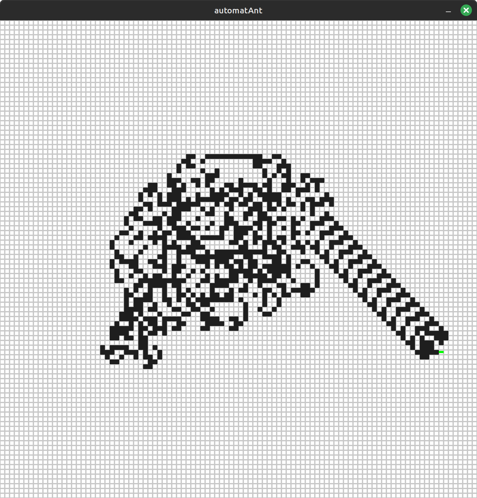

## Langton's Ant Cellular Automaton  
Implemented in Python using the Pygame library.  

  

## Controls  
* Right mouse button – Color the cells  
* Left mouse button – Clear the cells  
* Press any key to start or stop the simulation  
